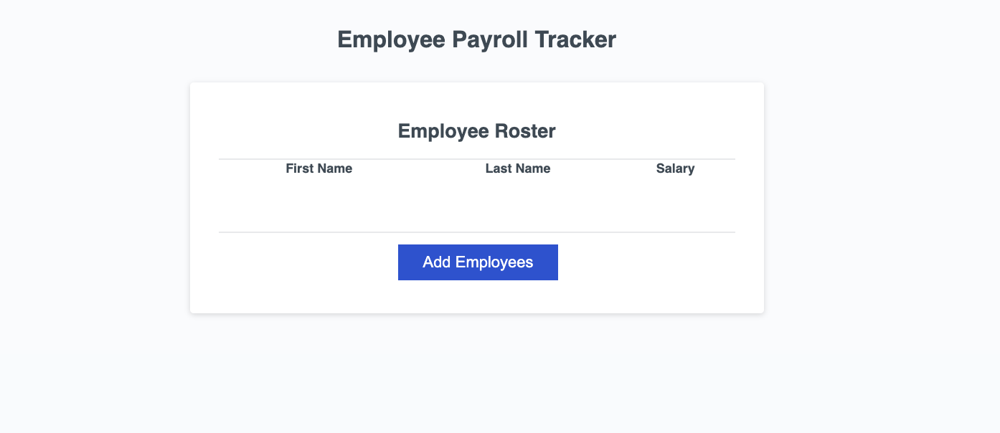

# Payroll

# Description
A simple web application for managing generating payroll salary reports.

# Features
- Calculate Employee salary.
- Delivers a simple, concise report.

# Usage
1. Open the website in your browser.
2. Enter Employee data.
3. Generates a table.

# Deployed project

## Acknowledgements

© 2024 edX Boot Camps LLC. Confidential and Proprietary. All Rights Reserved.